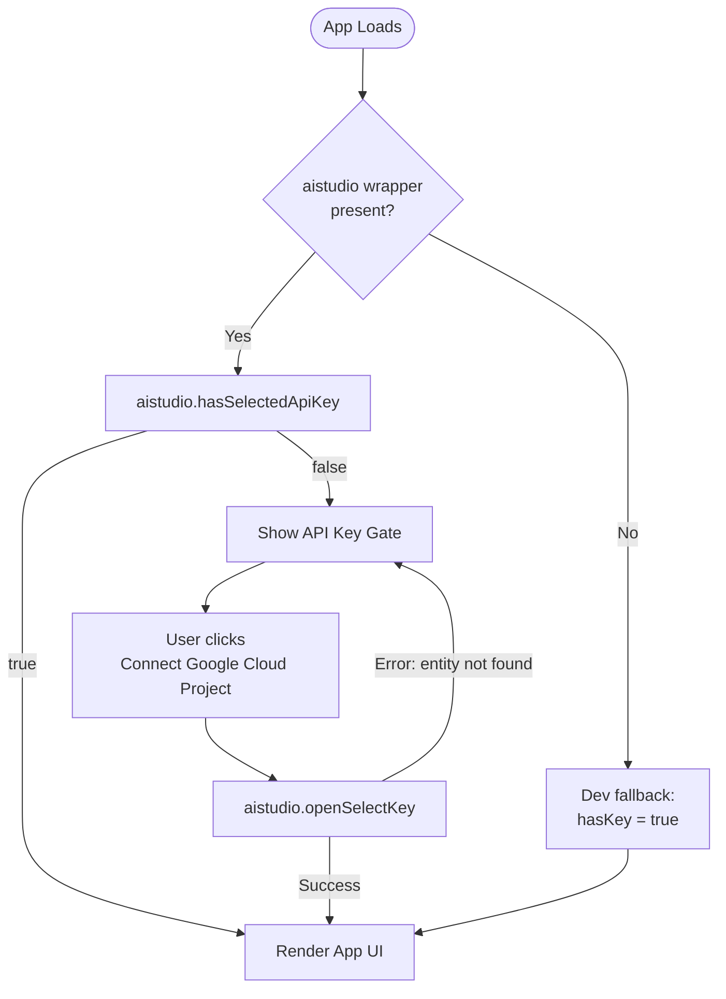

# EcomLens AI 📸

### Turn any product photo into professional e-commerce listings in seconds — powered by Gemini 2.5 Flash AI.

[](https://react.dev)
[](https://www.typescriptlang.org)
[](https://tailwindcss.com)
[](https://vitejs.dev)
[](https://ai.google.dev)
[](https://github.com/yatinbhalla/EcomLens-AI/commits/main)
[](https://github.com/yatinbhalla/EcomLens-AI/pulls)

> 🚀 **Live on Google AI Studio:** [Open App](https://ai.studio/apps/c6de8e55-c590-4f3f-8705-53edc34a2adc?fullscreenApplet=true)

---

>

---

## 📋 Table of Contents

- [Overview](#-overview)
- [Why EcomLens AI](#-why-ecomlens-ai)
- [Key Features](#-key-features)
- [Tech Stack](#-tech-stack)
- [Project Layout](#-project-layout)
- [API Key & Auth Flow](#-api-key--auth-flow)
- [Application State](#-application-state)
- [Components](#-components)
- [NLP & AI Routing](#-nlp--ai-routing)
- [Hooks & Utilities](#-hooks--utilities)
- [Getting Started](#-getting-started)
- [Known Limitations](#-known-limitations)
- [Contributing](#-contributing)
- [Author](#author)

---

## 🚀 Overview

E-commerce sellers waste hours and thousands of dollars on product photography — only to need reshoots every time a platform, format, or style requirement changes.

**EcomLens AI eliminates that entirely.** Upload any product photo, select a platform-optimized preset or write a custom prompt, and the app calls Gemini 2.5 Flash Image to generate **4 studio-quality variants in ~30 seconds** — across 5 e-commerce style profiles and 5 output aspect ratios, all exportable as a single ZIP.

**Reduced manual photo generation and editing time by ~2 hours per day** for active sellers, as measured by 3 daily users who replaced their previous manual workflow entirely — by architecting a sequential Gemini multimodal pipeline with platform-optimized prompt presets, canvas-based resizing, and a React 19 streaming UI that delivers results as they generate.

Shipped from zero to deployed in a single weekend as a solo AI product build.

---

## 🤔 Why EcomLens AI

| Without EcomLens AI | With EcomLens AI |
|---|---|
| Book a photographer, set a studio | Upload a phone photo |
| Wait days for edited deliverables | 4 variants in ~30 seconds |
| ~2 hours/day manually editing & generating | Automated — prompt once, download ZIP |
| Re-shoot for every platform format | Switch presets, regenerate instantly |
| Export, resize, reformat manually | Canvas-based resize to any px spec |
| ₹5,000–₹20,000 per shoot | Cost of a Gemini API call |
| Used by 1 person | Actively used daily by 3 sellers |

**Who is this for?**

- **D2C founders & SME sellers** listing on Amazon, Meesho, Flipkart, or Instagram
- **Product managers** prototyping AI-assisted content workflows
- **Developers & AI builders** exploring multimodal Gemini APIs in production UX

---

## ⚙️ Key Features

- **Validated with 3 daily active users** who replaced their manual photo-editing workflow, saving ~2 hours/day per seller across Amazon, Meesho, and Instagram listings
- **Engineered 5 platform-specific style presets** (Amazon, Meesho, Lifestyle, Premium, Minimalist) with fine-tuned prompt templates — eliminating guesswork for non-technical sellers
- **Architected sequential Gemini API calls** with 500ms backoff and automatic 429 / `RESOURCE_EXHAUSTED` detection — preventing quota burnouts during batch generation
- **Implemented 5 output aspect ratios** (1:1, 3:4, 4:3, 9:16, Custom up to 4096×4096) with canvas-based pixel-perfect resizing for any platform's listing spec
- **Shipped real-time streaming results UI** — skeleton placeholders update as each of the 4 variants resolves, reducing perceived wait by surfacing results progressively
- **Integrated one-click bulk ZIP export** via JSZip + FileSaver, packaging all variants under `ecomlens_images/` for instant upload to any marketplace
- **Wired an API key gate** that validates Google Cloud Project access before any generation fires — preventing silent failures in production
- **Built a stop-mid-generation control** that breaks the sequential loop cleanly between API calls — no orphaned requests or stale state
- **Designed, built, and deployed end-to-end in a single weekend** — from Gemini API integration to production on Google AI Studio

---

## 🧠 Tech Stack

### Frontend


### AI / ML


### Utilities & Tooling


---

## 🗺️ Project Layout

<details>
<summary>Expand file tree</summary>

```
EcomLens-AI/
│
├── App.tsx                     # Root component: state, generation orchestration, two-column layout
├── index.tsx                   # React 19 entry point
├── index.html                  # HTML shell with Vite injection
├── index.css                   # Global base styles (Tailwind directives)
├── types.ts                    # Shared TypeScript types (GeneratedImage, AspectRatio, PresetStyle, GenerationSettings)
├── constants.ts                # Preset prompt templates, preset icons map, aspect ratio config array
├── metadata.json               # Google AI Studio app metadata
│
├── components/
│   ├── ApiKeyGate.tsx          # Validates Google Cloud Project API key; renders blocking Connect CTA if absent
│   ├── ImageUploader.tsx       # Drag-and-drop / click-to-upload product photo input with preview & clear
│   ├── PromptControls.tsx      # Style preset chips, aspect ratio selector, custom prompt textarea, Generate/Stop
│   └── ImageGallery.tsx        # 4-up results grid with skeleton loading, per-image download, bulk ZIP export
│
├── services/
│   └── geminiService.ts        # Gemini API client: builds multimodal request, parses inlineData response
│
└── utils/
    └── fileUtils.ts            # fileToBase64, downloadImage, downloadAllAsZip, resizeImage (canvas-based)
```

</details>

---

## 🔐 API Key & Auth Flow

EcomLens AI uses Google AI Studio's `aistudio.hasSelectedApiKey` / `openSelectKey` bridge to validate a paid Google Cloud Project before any generation is attempted. In standard local dev (without the AI Studio wrapper), the gate defaults open so development is never blocked.



---

## 🧩 Application State

State lives entirely in `App.tsx` via React `useState` — no external state manager needed for this single-page linear workflow.

| State Variable | Type | Purpose |
|---|---|---|
| `selectedImage` | `string \| null` | Base64 data URL of the uploaded product photo |
| `generatedImages` | `GeneratedImage[]` | Accumulates variants as each Gemini call resolves |
| `isGenerating` | `boolean` | Drives skeleton UI; disables the Generate button |
| `shouldStop` | `boolean` | Signals the generation loop to break before the next API call |
| `error` | `string \| null` | Surfaces quota / rate-limit / unknown errors inline |
| `settings` | `GenerationSettings` | Active preset, custom prompt, aspect ratio, custom dimensions |

**Data flow:** `ImageUploader` sets `selectedImage` → `PromptControls` updates `settings` → `handleGenerate` calls `geminiService` sequentially → each resolved image is pushed into `generatedImages` → `ImageGallery` renders progressively.

---

## 🧩 Components

| Component | Purpose |
|---|---|
| `ApiKeyGate` | Guards the app behind Google Cloud Project validation; renders a blocking screen with a Connect CTA if no key is found |
| `ImageUploader` | Accepts product photos via drag-and-drop or file picker; converts to base64 data URL; shows preview with a clear button |
| `PromptControls` | Houses aspect ratio selector, 5 style preset chips, custom prompt textarea, and Generate / Stop buttons with correct disabled states |
| `ImageGallery` | Renders a responsive 3-column grid; shows animated skeleton placeholders for in-flight requests; per-image download + bulk ZIP export |

---

## 🧠 NLP & AI Routing

### Model

`gemini-2.5-flash-image` — Google's multimodal generation model that accepts image + text input and returns a generated image inline.

### Prompt Architecture

Every generation request wraps the user's style input in a **fixed structure that anchors product fidelity**:

```
Generate a photorealistic, professional product image based on the input image.
The product in the new image MUST look like the product in the input image.
Apply this style/setting: {user_prompt_or_preset}.
Ensure good resolution and correct lighting.
```

The fidelity instruction (`MUST look like the product`) is non-negotiable and prepended to every call — preventing Gemini from drifting to a generic stock-photo aesthetic.

### Style Preset Prompts

| Preset | Optimized For | Prompt Strategy |
|---|---|---|
| **Amazon** | Marketplace listing | Pure white RGB(255,255,255) bg, even studio lighting, no harsh shadows |
| **Meesho** | Value-segment D2C | Light grey bg, bright lighting, vibrant colors, approachable look |
| **Lifestyle** | Social / brand content | In-context usage, blurred natural bg, warm sunlight, organic feel |
| **Premium** | Luxury / D2C brand | Dark moody bg, dramatic rim lighting, cinematic high contrast |
| **Minimalist** | Trendy / editorial | Solid pastel bg, hard shadows, pop-art composition |

### Generation Loop & Rate-Limit Handling

```
for i in 0..3 (TARGET_COUNT = 4):
  → check shouldStop flag → break if true
  → call generateProductImage (Gemini 2.5 Flash Image)
  → if 429 / RESOURCE_EXHAUSTED → surface error, break loop
  → if other error → log, continue to next attempt
  → push resolved image to state immediately
  → wait 500ms (rate-limit backoff)
```

### Aspect Ratio Mapping

Custom pixel dimensions are mapped to the nearest supported Gemini `imageConfig.aspectRatio` value at runtime, then the output is resized to exact pixels via the canvas utility — covering any marketplace's listing spec.

---

## 🔧 Hooks & Utilities

| Utility | File | Purpose |
|---|---|---|
| `fileToBase64` | `utils/fileUtils.ts` | Converts a `File` object to a full base64 Data URL via `FileReader` |
| `downloadImage` | `utils/fileUtils.ts` | Fetches a base64 data URL and triggers a `saveAs` browser download |
| `downloadAllAsZip` | `utils/fileUtils.ts` | Bundles all generated images into an `ecomlens_images/` ZIP folder and triggers download via FileSaver |
| `resizeImage` | `utils/fileUtils.ts` | Canvas-based cover-crop resize with `imageSmoothingQuality: 'high'` — letterboxes/pillarboxes to exact pixel dimensions |
| `generateProductImage` | `services/geminiService.ts` | Initializes `GoogleGenAI` client, builds multimodal request with image + structured prompt, parses `inlineData` from response |

---

## 🚀 Getting Started

### Prerequisites

- Node.js ≥ 18
- A [Gemini API key](https://aistudio.google.com/app/apikey) (free tier works for testing; paid Google Cloud Project for production volumes)

### Install & Run

```bash
# 1. Clone the repo
git clone https://github.com/yatinbhalla/EcomLens-AI.git
cd EcomLens-AI

# 2. Install dependencies
npm install

# 3. Configure your Gemini API key
# Create a .env.local file and add:
# GEMINI_API_KEY=your_key_here

# 4. Start the dev server
npm run dev
```

### Environment Variables

<details>
<summary>Expand env vars</summary>

| Variable | Required | Description |
|---|---|---|
| `GEMINI_API_KEY` | ✅ | Your Google Gemini API key from [AI Studio](https://aistudio.google.com/app/apikey). Read at runtime via `process.env.API_KEY` in `geminiService.ts`. |

</details>

### Build for Production

```bash
npm run build    # Outputs to /dist
npm run preview  # Preview production build locally
```

---

## Known Limitations

- **4 variants hardcoded** — `TARGET_COUNT` is not exposed in the UI; a "number of variants" slider is a natural v2 feature
- **No persistent session history** — generated images live only in component state and are cleared on page refresh; localStorage or a lightweight backend store would unlock history
- **Rate limits hit quickly on free Gemini tier** — the app surfaces `RESOURCE_EXHAUSTED` errors clearly but does not auto-retry with exponential backoff; v2 should add intelligent retry logic
- **Custom dimensions approximate** — Gemini doesn't support arbitrary aspect ratios; the canvas resize is best-effort and may introduce slight letterboxing on non-standard ratios
- **API key exposed client-side** — `.env.local` is fine for personal use and development; production deployments should route generation through a server function or edge API proxy
- **Single SKU per session** — batch upload of multiple product SKUs is the most-requested v2 feature for sellers managing large catalogs

---

## Contributing

EcomLens AI is actively evolving — contributions, issues, and product critiques are genuinely welcome.

If you've spotted a bug, have a feature idea, or want to extend the Gemini integration (Veo for video? multi-SKU batch? auto-export to Amazon Seller Central?), please:

1. [Open an issue](https://github.com/yatinbhalla/EcomLens-AI/issues) — describe what you're seeing or proposing
2. Fork the repo and open a PR — rough drafts are welcome for discussion
3. Drop product feedback — as a PM-built tool, UX and workflow critiques are just as valuable as code

---

## Author

**Yatin Bhalla · Product Manager & AI Product Builder**

[](https://linkedin.com/in/yatinbhalla42)
[](mailto:yatinbhalla42@gmail.com)
[](https://x.com/yatinbhalla42)
